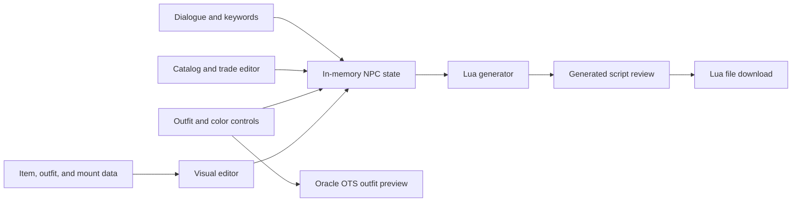

<p align="center">
  
</p>

<h1 align="center">Sorairei NPC Maker</h1>

<p align="center">
  A browser-based visual editor for creating Canary, Crystal, and TFS 1.8 NPCs with RevScripts.
</p>

<p align="center">
  <a href="https://github.com/Sorairei/sora-npcmaker"><strong>View the repository</strong></a>
  ·
  <a href="https://github.com/Sorairei/sora-npcmaker/issues">Report an issue</a>
  ·
  <a href="https://github.com/sponsors/Sorairei">Sponsor the project</a>
</p>

<p align="center">
  <a href="LICENSE"></a>
  
  
  <a href="https://github.com/sponsors/Sorairei"></a>
</p>

## Overview

Sorairei NPC Maker is a specialized visual editor for rapidly building NPC scripts for **Canary, Crystal, and TFS 1.8** ecosystems. It combines character configuration, a real-time outfit preview, a searchable item catalog, trade management, dialogue editing, custom keyword responses, and clean Lua export in a single interface.

The application is made from static HTML, CSS, JavaScript, images, and local catalog data. It requires no build step, backend, database, account, API key, or server-side processing. Open `index.html` in a modern browser, configure the NPC, and download the generated RevScript.

## Contents

- [Highlights](#highlights)
- [How it works](#how-it-works)
- [Character and dialogue configuration](#character-and-dialogue-configuration)
- [Trade system](#trade-system)
- [Architecture](#architecture)
- [Repository structure](#repository-structure)
- [Security and privacy](#security-and-privacy)
- [Installation and usage](#installation-and-usage)
- [Validation](#validation)
- [Limitations](#limitations)
- [Contributing](#contributing)
- [Sponsorship](#sponsorship)
- [License](#license)

## Highlights

| Area | Capabilities |
| --- | --- |
| Engine compatibility | Generates RevScript NPC Lua for Canary, Crystal, and TFS 1.8 workflows |
| Visual outfitter | Real-time preview for 995 named male, female, and monster appearances |
| Appearance | Look type, addons, 245 mounts, indexed Tibia colors, and stable Tibia-style name and health bar positioning |
| Item catalog | 6,835 bundled item sprites across 28 audited categories, searchable by client ID or name |
| Trading | Buy and sell price configuration with a reviewable trade list |
| Dialogue | Greeting, farewell, walk-away messages, and custom keyword responses |
| Lua export | Readable generated source with direct `.lua` download |
| Deployment | Static browser application with no package installation required at runtime |

## How it works

1. The user defines the NPC name, health, walk interval, and walk radius.
2. Outfit, addon, mount, and color controls update the visual preview immediately.
3. Catalog selections build the NPC's buy and sell inventory.
4. Dialogue fields and keyword-response pairs define conversation behavior.
5. The generator converts the in-memory NPC state into a compatible RevScript for Canary, Crystal, and TFS 1.8 workflows.
6. The generated Lua can be reviewed in the application and downloaded as a `.lua` file.

No project data is uploaded or persisted by the application. Starting a new NPC reloads the page and clears the current in-memory configuration.

## Character and dialogue configuration

### General settings

| Setting | Purpose | Generated field |
| --- | --- | --- |
| NPC name | Internal and displayed NPC identity | `npcConfig.name` and `npcConfig.description` |
| Health | Current and maximum health | `npcConfig.health` and `npcConfig.maxHealth` |
| Walk interval | Delay between movement attempts | `npcConfig.walkInterval` |
| Walk radius | Allowed movement distance; `0` creates a stationary NPC | `npcConfig.walkRadius` |

### Appearance

The outfitter groups available looks into male, female, and monster categories. Users can enable outfit addons, select a mount, choose colors from the Tibia palette, or randomize colors and the complete appearance. The preview is refreshed through the Oracle OTS outfit image service.

### Dialogue and keywords

The standard greeting, farewell, and walk-away messages support Canary placeholders such as `|PLAYERNAME|`. Additional trigger-response pairs are exported through `keywordHandler:addKeyword`, allowing the NPC to answer custom conversation topics.

## Trade system

The Trade workspace includes two optional, browser-friendly commercial NPC tools:

- **NPC Shop Templates** provides audited gold-only merchants. A template may replace the current NPC's identity, outfit, basic messages, and shop, or merge only missing shop entries. Quest exchanges, custom currencies, mission logic, rewards, storage checks, and teleport behavior are excluded.
- **Smart Economy Analyzer** compares the current shop against estimated Tibia RL prices and reports suspicious deviations, duplicate entries, and configurations that permit an infinite self-trade profit.

The compact reference dataset is loaded only when either tool is opened. Source Lua files are parsed statically during development and are never shipped or executed in the user's browser.

Regenerate the audited dataset with an existing NPC directory and an optional primary RL price table:

```powershell
node tools/import_shop_templates.js --npc-dir "path/to/npc" --prices "path/to/shops.lua" --output shop_templates.js
```

The bundled catalog can be filtered by item category or searched by item name and modern client ID. Each selected item may define a buy price, a sell price, or both. The resulting trade list is emitted as `npcConfig.shop`, together with the standard Canary buy, sell, and item-check callbacks.

Item names, prices, and client IDs remain visible in the editor before export so the complete shop configuration can be reviewed.

## Architecture



### Main design boundaries

- **Presentation layer:** `index.html` and `styles.css` define the RPG-inspired editor, panels, modals, responsive layout, and BeeTales branding.
- **State and interaction layer:** `app.js` owns the current NPC configuration, UI events, catalog search, palette behavior, preview updates, and download flow.
- **Preview geometry layer:** `preview_geometry.js` keeps creature information anchored to Tibia's bottom-right 32x32 creature tile, independently of addon and monster silhouettes.
- **Generation layer:** `generator.js` escapes user strings, validates numeric settings, and serializes the NPC state into Canary RevScript Lua.
- **Data layer:** `data.js`, `outfit_data.js`, and `items/` provide the local item, outfit, mount, category, and sprite catalogs.
- **External preview boundary:** only character preview images depend on the Oracle OTS service; Lua generation remains local.

## Repository structure

| Path | Responsibility |
| --- | --- |
| `index.html` | Application shell, editor panels, generated-code modal, help content, and footer |
| `styles.css` | RPG visual system, responsive layout, controls, tables, modals, branding, and footer styles |
| `app.js` | NPC state, UI interactions, autocomplete, catalog, outfitter, colors, dialogue, and downloads |
| `generator.js` | Canary RevScript Lua generation, defaults, validation, and escaping |
| `preview_geometry.js` | Stable outfit, addon, mount, and monster preview anchoring |
| `data.js` | Item catalog, categories, mounts, and fallback outfit metadata |
| `outfit_data.js` | Named male, female, and monster outfit definitions |
| `outfit_bounds.js` | Generated visible sprite bounds used by preview geometry |
| `items/` | Local item sprite catalog used by search, categories, and trade lists |
| `tools/` | XML/OTB catalog importer, shop-template importer, classification overrides, and outfit-bound generator |
| `assets/` | BeeTales logo, Sora mascot, and favicon assets |
| `test/` | Dependency-free Node.js regression tests for Lua generation |
| `.github/FUNDING.yml` | GitHub Sponsors configuration |

## Security and privacy

| Protection | Behavior |
| --- | --- |
| HTML sanitization | Dynamic item names, values, and keyword content are escaped before insertion into rendered tables |
| Lua string escaping | Backslashes, quotes, line endings, and tabs are escaped before entering generated Lua strings |
| Numeric safeguards | Health, movement, outfit, mount, item ID, and shop price values are normalized before Lua generation |
| Local generation | NPC configuration and Lua generation remain inside the browser |
| No tracking | The project contains no accounts, analytics, advertising, or remote storage |

The application does request remote Google Fonts and outfit preview images. Item sprites, catalog data, application logic, and Lua generation are served locally.

## Installation and usage

1. Clone or download the repository.
2. Open `index.html` in a modern browser.
3. Configure the NPC's general settings, appearance, shop, dialogue, and keywords.
4. Select **Generate .LUA** and review the resulting script.
5. Download the file and place it in the Canary server's `data/npc` directory.

```bash
git clone https://github.com/Sorairei/sora-npcmaker.git
cd sora-npcmaker
```

No runtime dependency installation is required.

## Updating the item catalog

The dependency-free importer matches new `items/*.gif` filenames to one or more
Open Tibia XML catalogs and updates `data.js` without touching existing entries:

```bash
node tools/import_items.js --xml path/to/items.xml --xml path/to/newer-items.xml --otb path/to/items.otb --overrides tools/item_overrides.json --git-untracked
```

Later XML files take priority over earlier ones. Categories are derived first
from `primarytype`, then from `weaponType`, with conservative fallbacks for
slots and well-known item names. Unsupported items go to `Others`, while
decaying corpse states are excluded. Add confirmed names or category exceptions
to `tools/item_overrides.json`; use `--dry-run` to preview counts without writing.
Pass `--audit-existing` to re-check existing catalog categories against explicit
XML attributes. Canonical `primarytype` values take precedence, with
`weaponType` used as a fallback for older XML entries that omit `primarytype`.
An optional `--otb` source validates server/client IDs and structural item flags.
Use `--prune-non-pickupable` with it to remove static map objects from the NPC
catalog.

## Validation

With Node.js 18 or newer installed, run the dependency-free syntax and generator test suite:

```bash
npm run check
```

The validation command checks application, preview geometry, generator, and importer syntax. Regression coverage includes default generation, stationary NPCs, numeric normalization, Lua string escaping, shop callbacks, XML/OTB categorization, corpse exclusion, stable addon positioning, mount bounds, and 32px/64px monster anchors.

## Limitations

- Outfit previews require an internet connection and availability of the Oracle OTS image service.
- Google Fonts are loaded remotely; the browser uses fallback fonts if they are unavailable.
- The current NPC configuration is held in memory and is not restored after reloading or closing the page.
- The application exports RevScripts for Canary, Crystal, and TFS 1.8 workflows and does not target every Open Tibia server distribution.
- Item and outfit availability reflects the bundled catalog and may require periodic updates as server data evolves.
- Generated scripts should be reviewed before installation on a production server.

## Contributing

Bug reports, catalog corrections, compatibility fixes, interface improvements, and documentation updates are welcome. Use [GitHub Issues](https://github.com/Sorairei/sora-npcmaker/issues) for reproducible problems or feature proposals.

Contributions should preserve the static browser architecture, Canary RevScript compatibility, existing BeeTales visual identity, and dependency-free runtime.

## Sponsorship

Sorairei NPC Maker is free and open source. If the tool saves time while building a Canary server, you can support continued maintenance through [GitHub Sponsors](https://github.com/sponsors/Sorairei).

## License

Released under the [MIT License](LICENSE). Copyright © 2026 [Sorairei](https://github.com/Sorairei).

---

<p align="center">
  Built with care by <a href="https://github.com/Sorairei">Sorairei</a> and the BeeTales community.
</p>
